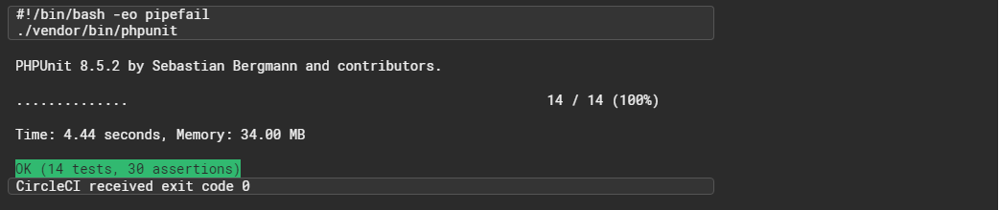

## Circle CI Test

## Technology Stacks and Tools
 
 - Laravel 
 - Vue JS
 - MySQL
 - Twitter Bootsrap
 - Axios HTTP Client
 - PHPUnit
 - Circle CI
  
## Set up Instruction
  - Clone the repo
  - CD into the directory you just cloned and type *touch .env* to create a new .env file
  - After that, copy all contents within the .env.example file into the newly created .env file and save
  - Install composer by running *composer install*
  - After that, Run
        
 *php artisan key:generate*  to generate a new key for development purposes. 

  - Open PHPMyAdmin or whichever tool you use and create a new mysql database
  - Open .env file and add the settings for the database in the appropriate section
  - To avoid issues due to cache, you can run *php artisan cache:clear* and *php artisab config:clear* to clear off any cached files.
  - Run database migrations with *php artisan migrate*
  - Install Laravel passport by running *php artisan passport:install*
  - Run the database seeder with *php artisan db:seed*
## Please Note:
  - Instead of using the default faker Image class to generate images, I used a custom class I created. The server generating the images for Faker is down. Faker by default uses http://lorempixel.com/ for fetching images on the fly. I am generating mine from https://picsum.photos. It's sharper and faster. 
  - I injected the implementation directory into the faker class. You may decide to abstract it or use it as a trait if you wish.
- If everything works fine, then run *php artisan serve*
- Copy the url and visit it on your web browser.

## API Deployment Approch

Ability to view the list or details of a movie sits behind an API endpoint. 

In a normal setting, I would return JSON data to the JS and allow it worry about rendering and all.
But for ease and speed, I chose to follow a different route. The API will compile the view files and send to JS to insert into the DOM. It's faster that way and just for this purpose.
 
## Credit
- Pexels.com -Stock photos
- W3layouts.com -Layout concept
- Pixabay.com -Stock photos

## PHP Unit Test

 
## License

This software is open-sourced software and licensed under the [MIT license](https://opensource.org/licenses/MIT).

